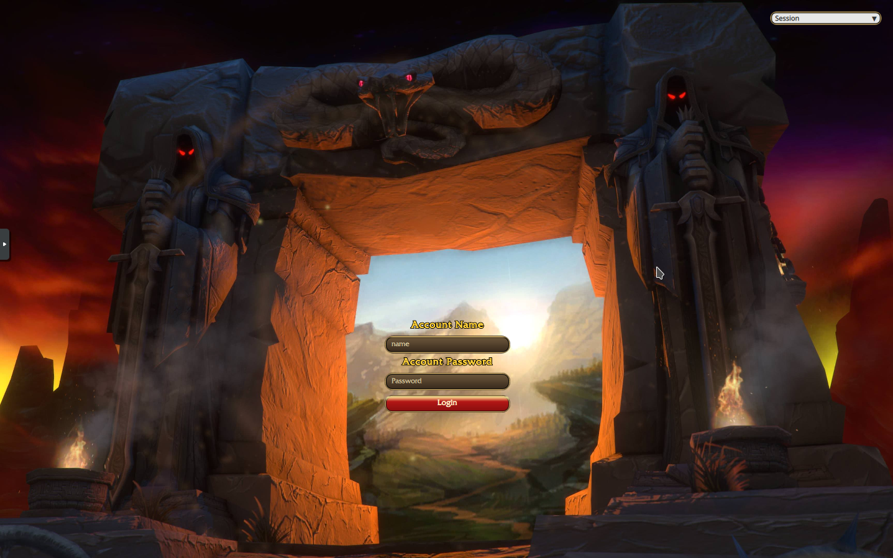

# WoW Classic–Inspired SDDM Theme (v2.2)
ChatGPT Vibe-coded POS sddm theme for wow nerds. 

## Install

clone the project directory and copy the files over to `/usr/share/sddm/themes/`

Afterwards edit your theme.conf file in /etc/sddm.conf.d/ and put in the following 

```bash
[Theme]
Current=wow-classic-sddm-theme
```

Then reboot and your ready to go 

## Preview Image 


